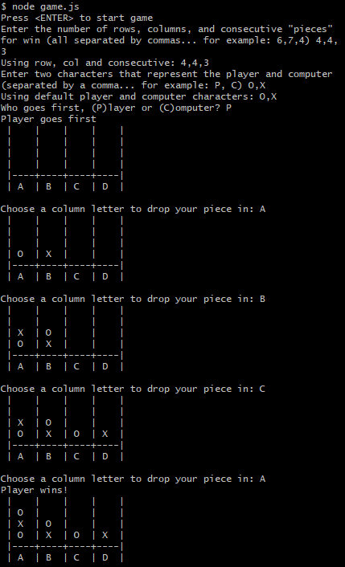

# Connectmoji

This is an interactive game made purely with JavaScript. The user faces off with the computer in a game of a modified "Connect 4". The game board length (number of columns and rows) and how many pieces needed to win are all decided by the user after the program prompts them. The pieces themselves can be decided (even emojis, hence the name *Connectmoji*) with any alphabetical letter. Each turn, the user enters a column to put their piece in until they or the computer has reached the required number of lined up pieces in order to win the game.

## Dependencies

*readlineSync*  
*wcwidth*  
*clear*

## Running the Project

In the src directory of the project's folder, enter *node game.js* in the terminal. Shortly after, the terminal will prompt you to press *ENTER* and will ask a series of questions to set up the board and pieces. 

## Example Game

## Scripted moves

There is an alternative way of running the game without having to go through prompted questions. After *node game.js*, you'll need to input a particular string of values that are comma separated which can autoplay the game for you. For example, "X,XOAABC,4,4,3". The first character, *X*, represents the player's piece. The next two characters represent the pieces that are to be played on the board (X is the player, O is the computer) and the remaining values consist of alternating column letters that represent as moves for the pieces. The last three numbers dictate the size of the board, same as before (rows, columns, and consectuive pieces needed to win).

## Example Script

