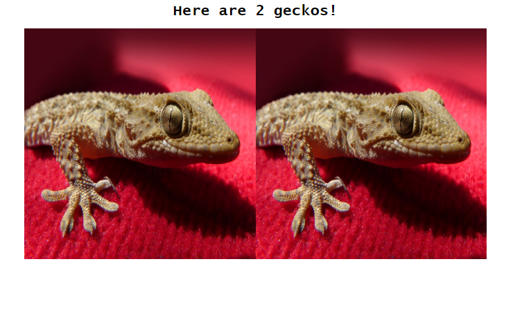

# A Site About Geckos

The main purpose of this project is to understand classes in JavaScript as well as serving static images on a TCP server. While running the project locally, a random number of images (between 1 and 4) will show up on the webpage.

## Dependencies

*path*  
*net*  
*fs* 

## Running the Project

In the terminal, *cd* into the *src* folder of the project directory and type *node app.js*. A local server should be running on port 3000. To see the images, visit the */gallery* route and a randomly generated number of random gecko images should appear.

## Example

